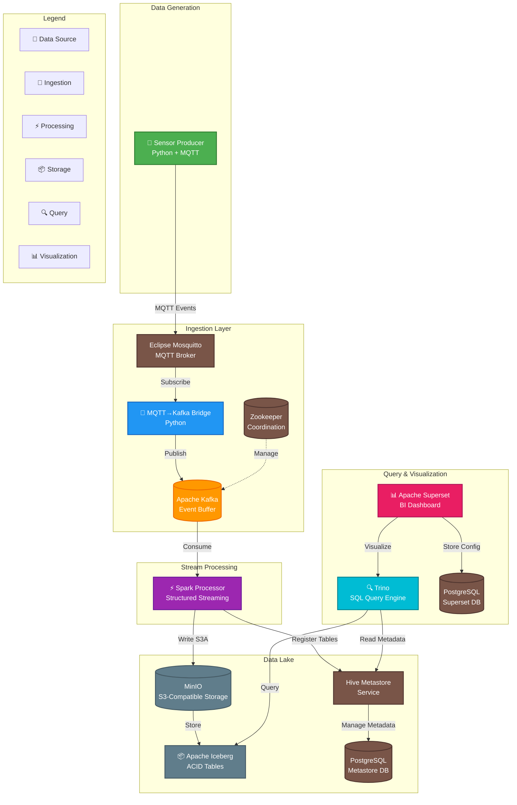

# 🛒 RetailSense: Real-Time Retail Analytics Pipeline
A POC, end-to-end real-time data pipeline that simulates IoT sensor data from retail stores, processes it using Apache Spark, stores it in a cloud-native data lake (Iceberg on MinIO), and visualizes insights via Apache Superset.

Built to demonstrate modern data engineering patterns: Event-driven architecture, stream processing, schema evolution, and reproducible infrastructure.


# 🚀 Quick Start
Requires [Docker Deskptop](https://www.docker.com/products/docker-desktop/)

Get the entire pipeline running in 3 commands. No complex setup required. 


## 1. Clone the repository
```
git clone https://github.com/Taabu/retailsense.git && cd retailsense
```
## 2. Initialize environment variables
```
cp .env.example .env
```
## 3. Start the stack
```
docker compose up -d
```
Wait ~2 minutes for services to initialize.

Kafka UI: http://localhost:8082

MinIO Console: http://localhost:9002 (Login: minioadmin / minioadmin)

Superset Dashboard: http://localhost:8088 (Login: admin / admin). Set the dashboard auto-refresh interval to 1 minute

## 🏗️ Architecture Overview


The system follows a Lambda-like architecture optimized for real-time analytics:

- Data Generation (Producer): Simulates 100+ sensor events/second (foot traffic, dwell time, demographics) from 3 stores with 4 zones each.

- Ingestion (Bridge): Subscribes to MQTT topics and forwards messages to Apache Kafka.

- Processing (Spark Processor):
Consumes from Kafka.
Cleans noisy data (filters invalid dwell times).
Enriches with metadata (peak hours, weekends).
Aggregates into 5-minute windows.
Writes to Apache Iceberg tables on MinIO (S3-compatible).

- Serving (Trino + Superset):
Trino acts as the SQL query engine over the Iceberg lakehouse.

- Superset provides real-time dashboards and visualization.

### Tech Stack
| Layer	| Technology | Purpose |
| -------- | ------- | ------- |
| Message Bus | Apache Kafka + Zookeeper | High-throughput event buffering |
| IoT Protocol | Eclipse Mosquitto (MQTT) | Lightweight sensor communication |
| Stream Processing | Apache Spark 3.5 | Structured Streaming & Transformations |
| Data Lake | Apache Iceberg | ACID transactions, schema evolution |
| Storage | MinIO | S3-compatible object storage |
| Query Engine | Trino | Distributed SQL analytics |
| Visualization | Apache Superset | BI & Dashboards |
| Infrastructure | Docker Compose | Reproducible local environment |

## 📊 Live Dashboards
Upon startup, the pipeline automatically populates the following metrics in Superset:

🔴 Live Visitor Count: Total visitors across all stores in the current 5-min window.

🏢 Store Performance: Bar chart comparing visitor volume per store.

📍 Zone Heatmap: Pie chart showing traffic distribution across store zones.


🛠️ Project Structure
```
retailsense/
├── modules/
│   ├── producer/       # Sensor simulation (Python)
│   ├── bridge/         # MQTT to Kafka bridge (Python)
│   └── processor/      # Spark streaming logic (Python)
├── infra/
│   └── docker/         # Docker configs, init scripts, and secrets
│       ├── postgres/
│       ├── hive/
│       ├── trino/
│       └── superset/
│           └── backups/        # Superset dashboard backups (for reproducibility)
├── docker-compose.yml  # Orchestrator
├── .env.example        # Environment template
└── README.md
```
## 🧪 Reproducibility & Testing
This project is designed to be 100% reproducible on any machine with Docker installed.


Automated Tests: Each module includes a pytest suite.
```
cd modules/producer && uv run pytest
```
```
cd modules/bridge && uv run pytest
```
```
cd modules/processor && uv run pytest
```
Dashboard Restoration: The Superset dashboard is exported as a backup (infra/docker/superset/backups/) and automatically restored on every container startup.
## 📝 Configuration
Key environment variables are defined in .env.example

Defaults are safe for local development

## 📄 License
MIT License. See LICENSE for details.

## 🤖 Created with the Help of [Lumo](https://lumo.proton.me/)
